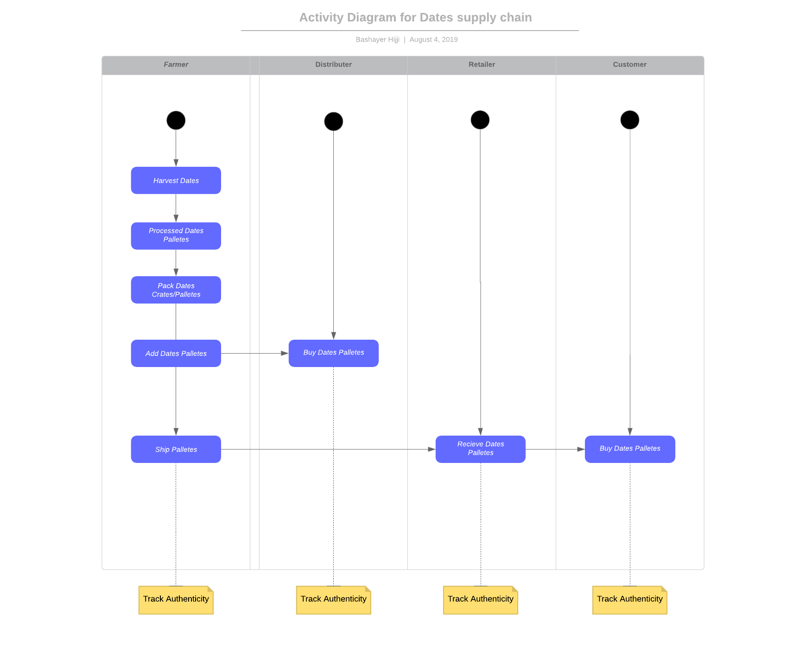
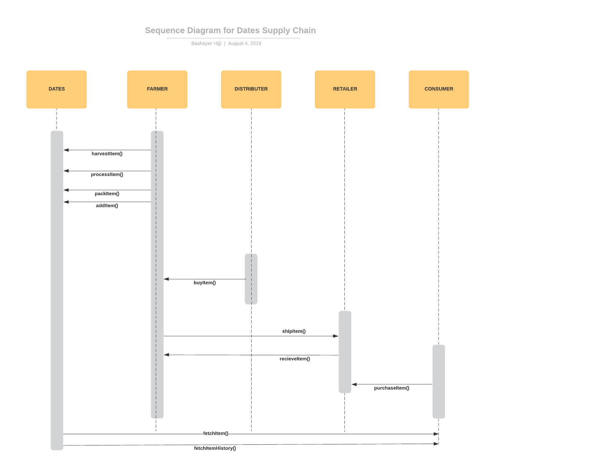
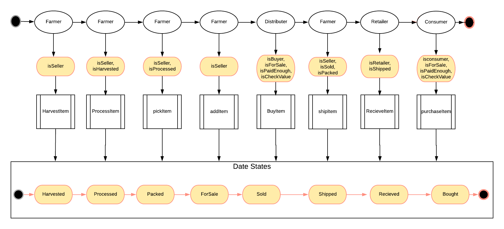
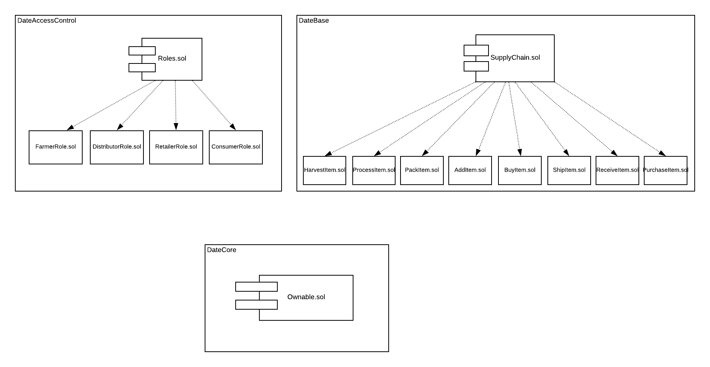

# Dates Supply Chain

## Description
Ethereum DApp that demonstrates a Supply Chain flow between a Seller and Buyer. The user story is similar to any commonly used supply chain process. A Seller can add items to the inventory system stored in the blockchain. A Buyer can purchase such items from the inventory system. Additionally a Seller can mark an item as Shipped, and similarly a Buyer can mark an item as Received.

### Actors
* Farmer
* Distributor
* Retailer
* Consumer

### Actions
* **Farmer** – harvest dates palletes, process dates palletes, pack dates bags, add dates palettes, ship dates palettes
* **Distributor** – buy dates palettes
* **Retailer** – receive dates palettes
* **Consumer** – buy dates items 

## UMLs

The following are the UMLs for Dates supply chain:

### Activity Diagram

### Sequence Diagram

### State Diagram

### Class Diagram

## Prerequisites

* Truffle v5.0.21 (core: 5.0.3)
* Solidity - >=0.4.21 <0.6.0; (solc-js)
* Node v10.2.0